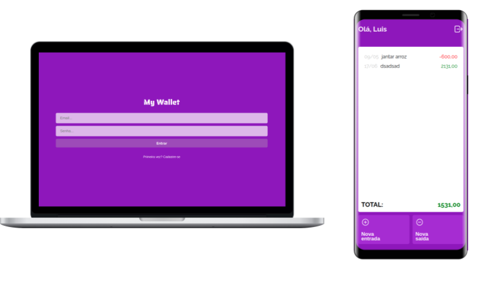

<h1 align="center"> My Wallet 💰</h1>

<h3 align="center">
<a href="https://my-wallet-front-puce.vercel.app/" target="_blank">
        
«Acessar Demostração»

</a>
</h3>

## Descrição 📎

My Wallet é uma aplicação financeira que busca gerenciar transferências monetárias do usuário logado. Para utilizar aplicação é necessário logar-se e criar entradas e saídas. Essa aplicação é feita em conjunto com a <a href="https://github.com/LuigiVanin/MyWallet-back"> api do my wallet.</a>

<h3 align="center">
<a href="https://github.com/LuigiVanin/MyWallet-back" target="_blank">
        
«Acessar Back-End»

</a>
</h3>

## Funcionalidades 🚀

-   Global

    -   [x] Banco de dados remoto Mongo.
    -   [x] Deploy público via Vercel.
    -   [x] Layout Mobile.
    -   [x] Deploy do backend com Heroku.
    -   [x] Login.
    -   [x] Sign up.
    -   [x] Autenticação com token.
    -   [x] Armazenamento do token via localstorage.

-   Painel principal

    -   [x] Visualização de todas as transferências do usário.
    -   [x] Transações negativas devem ser negativas e positivas devem ser verdes.
    -   [x] Datas de cada transferência.
    -   [x] Soma total dos valores de transferência.
    -   [x] Botão de entrada e saída.
    -   [x] Botão de logout.

-   Painel de adição de transferência
    -   [x] Saída e entrada de valores.
    -   [x] Botão de retorno.
    -   [x] Transações negativas devem ser negativas e positivas devem ser verdes.

## Ferramentas Utilizadas 🛠️

 

    
    
    
    
    
    
    
    
    
    

## Outras Ferramentas 📦

-   [Axios](https://axios-http.com/).
-   [Days.js](https://day.js.org/).
-   [Chalk](https://www.npmjs.com/package/chalk).
-   [Joi](https://joi.dev/).

## Entre em contato 📞

 

